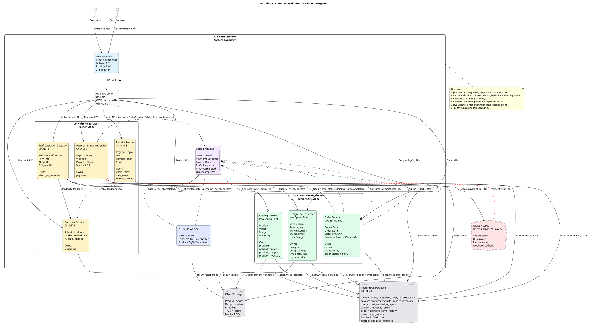

# System Architecture — AI T-Shirt Customization Platform

Tài liệu kiến trúc chính thức (source of truth). Sơ đồ C4 Container ở cuối file (PlantUML).

## Quyết định đã chốt

| Hạng mục | Quyết định |
|---|---|
| Repo | Monorepo, clone full, mỗi người mở subfolder của mình |
| Database | **1 PostgreSQL chung** — 18 bảng / 8 schema (KHÔNG tách DB per-service) |
| API entry | **API Gateway riêng** — Spring Cloud Gateway (Java), routing + JWT + role guard |
| Object storage | **MinIO** (S3-compatible) — product images, design preview, print files, try-on results, invoice PDFs |
| AI Try-On | Gọi **API ngoài** trực tiếp trong Java (tryon module), không tách worker riêng |
| Payment | **Thật** — PayOS / SePay + webhook về C# Payment Service |
| Messaging | Kafka (event bus) — do team tự cấu hình producer/consumer |
| Deploy | **Local hết** bằng Docker Compose |

## Phân chia service & ownership

**Java (`backend/java-core-api`)** — core domain
- Catalog: products, product_variants, product_images, product_inventory
- Design + Try-On: designs, design_layers, tryon_requests, tryon_results
- Order: orders, order_items, order_status_history

**C# (`backend/dotnet-platform-api`)** — platform & operation
- Identity: users, roles, user_roles, refresh_tokens
- Payment & Invoice: payments
- Feedback: feedbacks
- Staff Operation Gateway + Content: about_us_contents

**Gateway (`backend/api-gateway`)** — Spring Cloud Gateway, điểm vào duy nhất cho frontend.

## Cổng (local)

| Thành phần | Host port |
|---|---|
| api-gateway (FE gọi vào đây) | 8080 |
| java-core-api | 8081 |
| dotnet-platform-api | 8082 |
| postgres | 5432 |
| kafka (external) | 29092 |
| minio API / console | 9000 / 9001 |
| pgadmin / kafka-ui | 5050 / 8085 |

## Luồng chính
1. FE → **api-gateway** (JWT + role) → định tuyến tới Java hoặc C#.
2. Order tạo ở Java → publish `OrderCreated` → C# Payment consume.
3. C# Payment tạo checkout PayOS/SePay → webhook về C# → publish `PaymentSucceeded`.
4. Java Order consume `PaymentSucceeded` → order PAID + lock design + status history.
5. Try-On: Java gọi API AI ngoài, lưu `tryon_results` (mock/real).
6. Staff thao tác qua C# Operation Gateway → gọi Java Order API.

---

## C4 Container Diagram (PlantUML)

